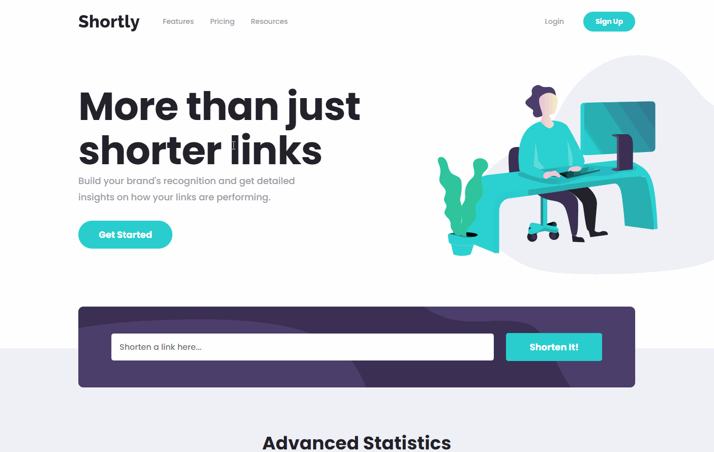

# Frontend Mentor - Shortly URL shortening API Challenge solution

This is a solution to the [Shortly URL shortening API Challenge challenge on Frontend Mentor](https://www.frontendmentor.io/challenges/url-shortening-api-landing-page-2ce3ob-G). Frontend Mentor challenges help you improve your coding skills by building realistic projects. 

## Table of contents

- [Overview](#overview)
  - [The challenge](#the-challenge)
  - [Preview](#preview)
  - [Links](#links)
- [Built with](#built-with)
- [Useful resources](#useful-resources)
- [Author](#author)

## Overview

### The challenge

Users should be able to:

- View the optimal layout for the site depending on their device's screen size
- Shorten any valid URL
- See a list of their shortened links, even after refreshing the browser
- Copy the shortened link to their clipboard in a single click
- Receive an error message when the `form` is submitted if:
  - The `input` field is empty

### Preview

Desktop Preview

Mobile Desktop

### Links

- Solution URL: [https://www.frontendmentor.io/solutions/urlshortening-app-created-with-react-sass-and-localstorage-EA8PjtUL7h](https://www.frontendmentor.io/solutions/urlshortening-app-created-with-react-sass-and-localstorage-EA8PjtUL7h)
- Live Site URL: [https://justcode11.github.io/url-shortening-api-master/index.html](https://justcode11.github.io/url-shortening-api-master/index.html)

## Built with

- Semantic HTML5 markup
- Sass
- Flexbox
- CSS Grid
- [React](https://reactjs.org/) - JS library

## Useful resources

- [Shrtco.de](https://shrtco.de/) - The URL Shortener API that I used
- [OpenReplay Blog Entry](https://blog.openreplay.com/build-a-url-shortener-in-react-with-shrtcode) - The Blog Entry from OpenReplay that helped me to implement the URL shortener from Shrtco.de

## Author

- Frontend Mentor - [@JustCode11](https://www.frontendmentor.io/profile/JustCode11)